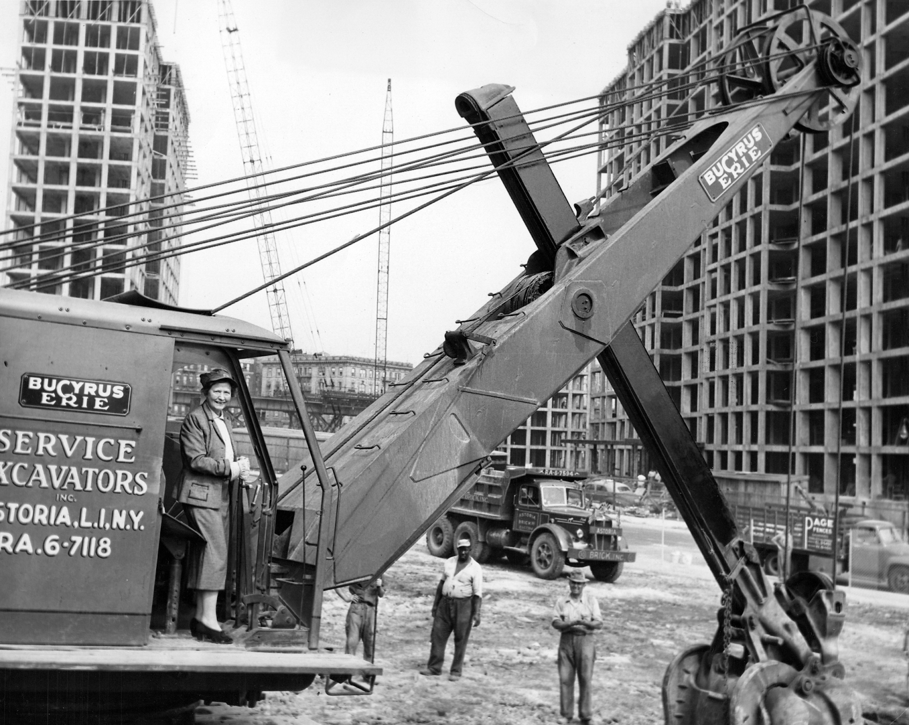
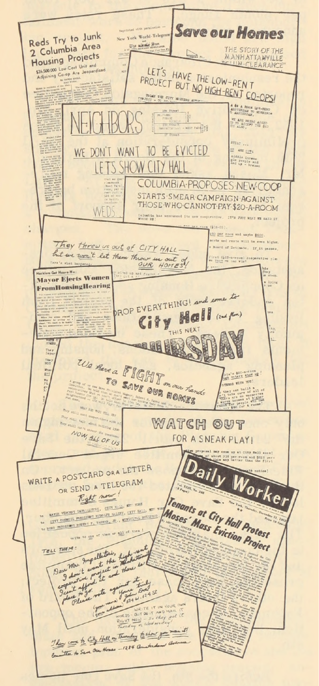

*Barnard President (and chairman of the board of the Morningside Heights Housing Corporation, Morningside Heights, Inc.) Millicent Carey McIntosh operates an excavator at the construction site of Morningside Gardens, 1955 (Barnard Archives and Special Collections)*

Since relocating from midtown Manhattan to the current locations in Morningside Heights in 1897, Barnard and Columbia administrations have sought to obtain real estate. In a study completed in 2018, the Trustees of Columbia University were identified as the second largest private landowner in New York City by number of buildings and parcels owned and the seventh largest private landowner by square footage. While Barnard owns nowhere near the volume or number of properties that Columbia does, the two institutions have used similar and sometimes coordinated tactics to marshall both the funding and the political will required for property acquisition and tenant eviction: declarations of blight and crime in Black and brown neighborhoods, slum clearance and urban renewal funding, and in the case of Columbia, eminent domain and the assertion of the private university as a public good. 

> “Columbia University was certainly a protagonist in this narrative, for a long time – they were responsible for displacement of people throughout the neighborhood. They set out to “clean up” the Upper West Side. It was about Columbia’s expansion, not so much as a university, but as a real estate empire.” - Nellie Hester Bailey, resident of the Blennerhasset (cite oral history)

The creation of a segregated, white neighborhood, with middle-class single-family rather than Single Room Occupancy (SRO) housing surrounding the University and other anchor institutions of the “Academic Acropolis” has been a stated or implicit goal of campus expansion since at least the 1930s. Recently retired Columbia President Nicholas Murray Butler wrote to the Columbia Board of Trustees in 1946 urging them to purchase property surrounding the University for future expansion and to protect Morningside Heights from the “greatly feared invasion from Harlem which has been threatened more than once.”

*Flyers of Save Our Homes organizers and clippings from Daily Worker articles, reproduced in Hepner, Elizabeth R, and Morningside Heights, Inc. Morningside-Manhattanville Rebuilds--: a Chronological Account of Redevelopment In the Morningside-Manhattanville Area, With Special Reference to the Development of Morningside Gardens. New York: Morningside Heights, Inc., 1955.*

Campus expansion has been met with opposition, legal challenges, and refusal by tenants, community organizations, building owners, students, and at times coalitions of these actors. From the Save Our Homes Committee, which unsuccessfully resisted the demolition of buildings and displacement of the “LaSalle Street Slum,” a racially integrated neighborhood, to make way for the middle-income Morningside Gardens co-op (and later the Grant Houses public housing project); to the tenants of the Blennerhasset (507 West 111th Street) who successfully held out against eviction and intimidation orchestrated by area institutions hoping to demolish eight apartment buildings to build an assisted living facility; to the lawsuits that business owners in Manhattanville filed in protest of their properties (which they would not sell to Columbia) being declared blighted and Coumbia’s aggressive use of eminent domain. 

## Sources

